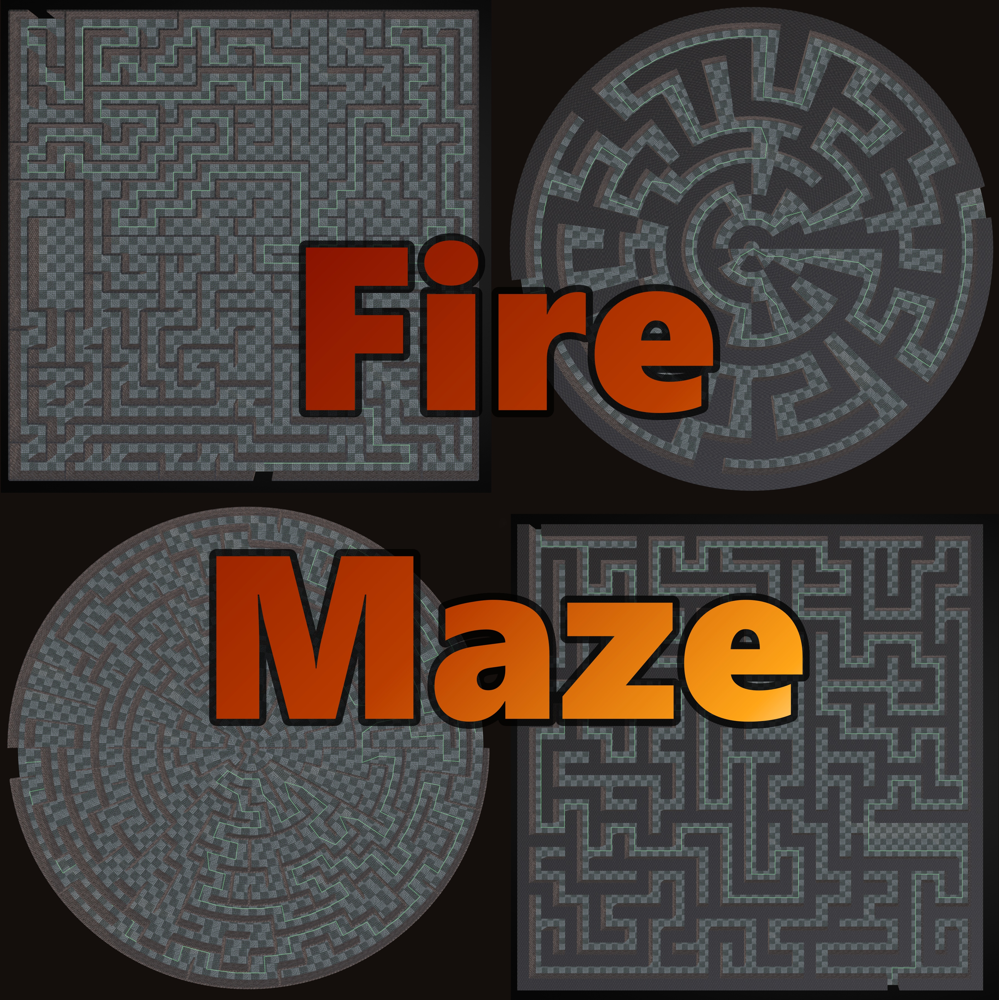

# FireMaze

A Blender 4.2+ extension for generating, editing, and customizing tile-based mazes.

It supports rectangular and polar (circular) grids, two construction modes (Thin walls and Cube pillars), 10 generation algorithms, procedural rooms, loop and pillar settings, image masking, custom collection randomization, interactive viewport editing, real-time pathfinding guides, vertex painting, prop/decor spawning, and full session save/load to disk.

---

## Table of Contents

- [Quick Start](#quick-start)
- [Installation](#installation)
- [Documentation](#documentation)
- [License](#license)

---

## Quick Start

1. **Install** the extension - see [Installation](#installation) below.
2. Open the 3D Viewport, press `N` to open the sidebar, and select the **FireRat** tab.
3. In the **Maze Settings** panel, pick a **Grid Type** (Rectangular or Polar), set **Width/Depth** or **Rings**, and choose a **Wall Mode** (Thin or Cube).
4. Click **Generate Maze** to create your maze. The default algorithm (Depth-First Search) works well for a first run.
5. *(Optional)* Click **Interactive Edit** in the **Generation & Editing** section to paint walls in the viewport. Left-click toggles walls on/off; Shift+left-click cycles through the meshes in your custom collection.

---

## Installation

FireMaze is structured as a standard Blender 4.2+ extension.

1. Zip the `FireMaze/` subdirectory to create `FireMaze.zip` (or use the pre-packaged ZIP in this repository).
2. In Blender, navigate to **Edit** -> **Preferences** -> **Get Extensions**.
3. Click the dropdown arrow (▼) in the top-right corner and choose **Install from Disk...**
4. Select `FireMaze.zip` and click Install.
5. Enable the extension. The interface will appear in the Sidebar (**N** key) under the **FireRat** tab.

---

## Documentation

Full documentation is split into separate reference guides:

- [Features & Settings Guide](docs/FEATURES.md): Detailed reference of Wall Modes, Grid Types, 10 Generation Algorithms, Rooms, Loops, Editor, Guide Paths, Custom Tiles, Vertex Painting, Prop Spawning, and Colliders.
- [Usage & Management Guide](docs/USAGE.md): Reference for Object Categories, Material Slots, Collection Management, Save/Load Sessions, Recovery Autosaves, and Image Exports.

---

## License

This addon is distributed under the GNU General Public License v3.0-or-later. See [`LICENSE`](LICENSE) for details.

Maintained by **FireRat666**. Issues and feedback are welcome via the GitHub issue tracker.
